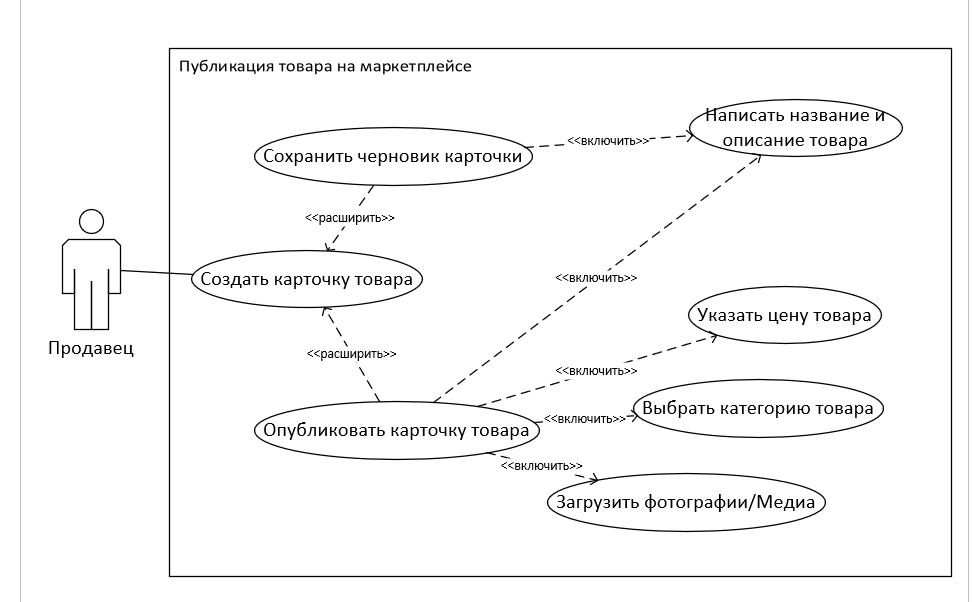
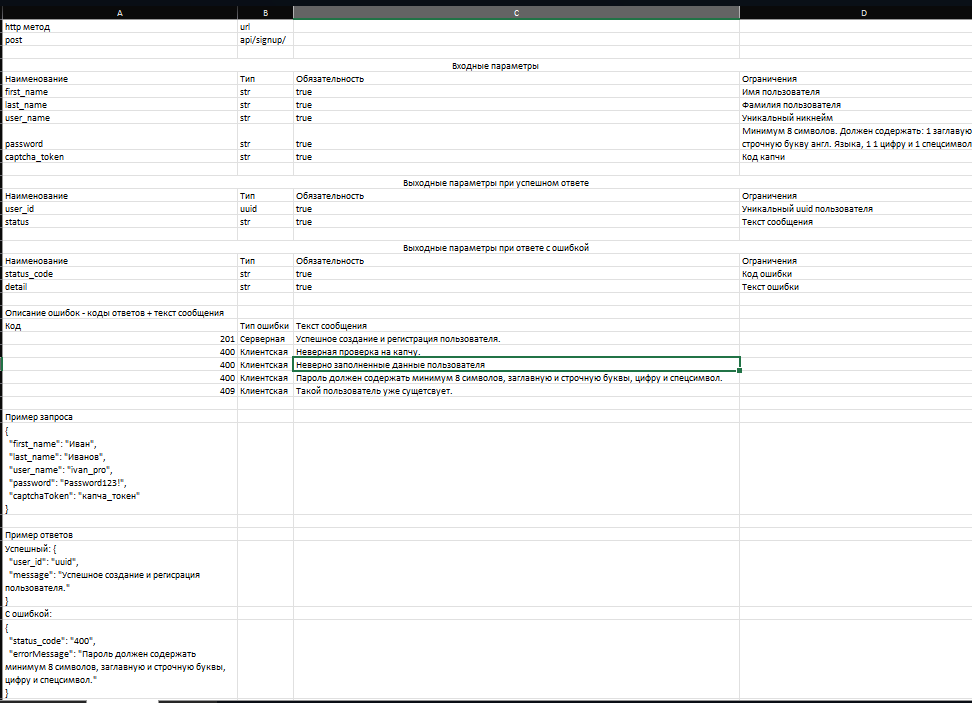

# Задание 1
### BPMN 2.0 диаграмма:  
(файл 1_task_bpmn.drawio)

# Задание 2
### 1. User story:
Я, как продавец товаров, хочу публиковать товары из личного кабинета, чтобы расширять свой ассортимент на маркетплейсе

### 2. Use case:
  

# Задание 3
### 3.1:

### 3.2:
(файл 3_2_task.vsdx)
